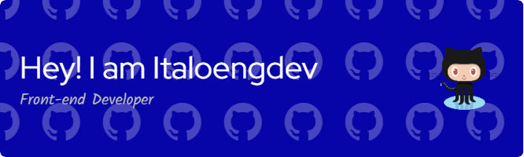

  

  

  

 
  

    
    
  

  
  <h1>
    Welcome Aboard!
  </h1>

---

### :woman_technologist: About Me :
I am a Front-end Stack Developer on construction  from Teresina, PI-Brazil.
- :telescope: I’m studing HTML, CSS, JavaScript and ReactJS for building web applications.

- :seedling: Patience, Focus and Peace.

- :zap: I’m looking to collaborate on some works to improve my knowledge.

- :mailbox: How to reach me: 

---

### :hammer_and_wrench: Languages and Tools :

  &nbsp;
  &nbsp;
  &nbsp;
  &nbsp;
  &nbsp;
  
  
  
  
  
  

---

### :fire: My Stats :

---

### :writing_hand: Blog Posts I found interesting:
<!-- BLOG-POST-LIST:START -->
https://daily.dev/
<!-- BLOG-POST-LIST:END -->

