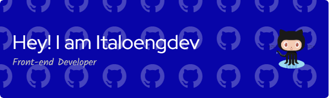

  

  

  

    
    
  

  

  <h1>
    Welcome Aboard! 🚀
  </h1>

---

### 👨‍💻 About Me

I’m **Italo Saraiva**, a **Full Stack / No-Code & Low-Code Developer** from **Teresina, PI – Brazil 🇧🇷**.  
I build **scalable web apps, internal tools, automations and MVPs**, combining **code + no-code** for speed and performance.

- 🔭 Currently working with **Bubble.io, Cursor AI, Next.js and Supabase**
- 🧠 Strong experience with **PDF data extraction, JSON processing and database automation**
- ⚡ Automation lover: **n8n & Power Automate**
- 🌱 Values: **Patience, Focus and Consistency**
- 🤝 Open to collaborate on **MVPs, SaaS, dashboards and automations**
- 📬 How to reach me:  
  

---

### 🧰 Languages, Platforms & Tools

  <!-- Frontend -->
  &nbsp;
  &nbsp;
  &nbsp;
  &nbsp;
  &nbsp;
  &nbsp;
  &nbsp;

  <!-- No-Code / Low-Code -->
  &nbsp;
  &nbsp;

  <!-- Backend / Infra -->
  &nbsp;
  &nbsp;

  <!-- Automation -->
  &nbsp;
  &nbsp;

  <!-- Tools -->
  &nbsp;
  &nbsp;

---

### 🔥 What I Actually Build

- ✅ SaaS MVPs with **Bubble + Supabase**
- ✅ Internal dashboards & admin panels
- ✅ PDF → JSON → Database pipelines
- ✅ API integrations (REST, Webhooks)
- ✅ WordPress automation & content publishing via API
- ✅ AI-assisted development using **Cursor**

---

### 📊 GitHub Stats

---

### ✍️ Resources I Follow

<!-- BLOG-POST-LIST:START -->
- https://daily.dev/
- https://n8n.io/blog
- https://supabase.com/blog
<!-- BLOG-POST-LIST:END -->
